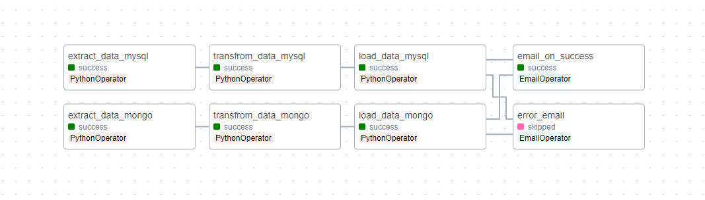
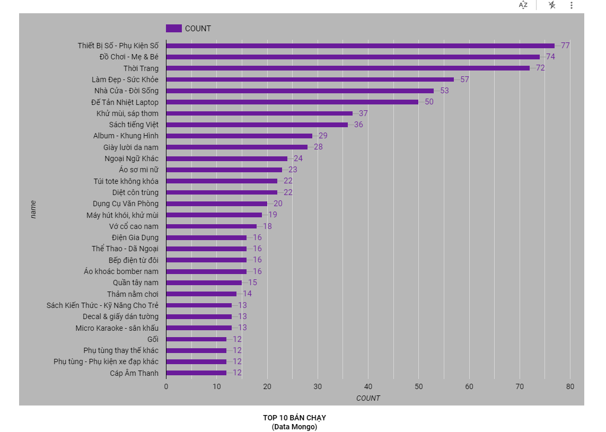
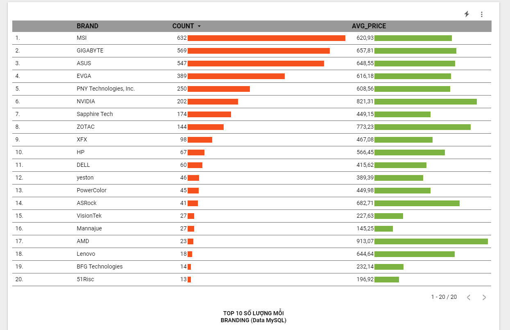

# ETL-data-with-airflow

**Project Description**
  * Automate update data from MongoDB, MySQL -> GCS -> GoogleBigquery
  * Auto-load data after updated data by Google Looker
  * Handle with large data (about 30Gb with 1m5 records)
  * Give email for successful or failure of ETL progress

**POC of Project**

**Airflow**

**DataMart (TIKI products) from MONGODB (GG Looker)**

**DataMart (Crawling products) from MYSQL (GG Looker)**

